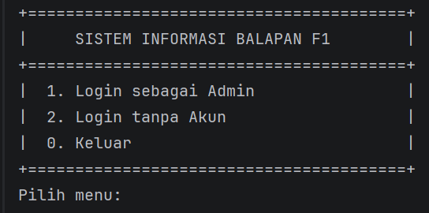
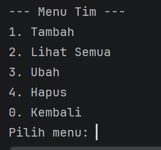

Nama  : Wahyu Aditya  
Nim   : 2409106067  
Kelas : B1'24  

1. Isi Program  
   Program yang dibuat ini berfungsi untuk melakukan crud (Untuk admin) dan read only untuk user
   sesuai dengan tema yang sudah dipilih. Tema yang dipilih praktikan adalah sistem
   informasi balapan formula 1. Untuk data yang bisa diubah sendiri ada 3, yaitu data pembalap, tim, dan jadwal balapan.
   Untuk data pembalap sendiri, yang bisa dicrud adalah nama, negara, nomor, dan tim. Untuk data tim yang bisa dicrud
   ada nama timnya, asal negara, mesin yang digunakan, dan nama chasisnya. Dan untul jadwalbalap yang bisa dicrud
   ada nama balapannya, lokasi, tanggal, dan putaran ke berapa balapan tersebut.  
    

2. Output Program  
   2.1 Output Awal  
     
    

   2.2 Login Admin  
     
    

   2.3 Menu Admin  
     
    

   2.4 Menu User  
     
    

   2.5 Menu Crud Pembalap  
     
    

   2.6 Menu Crud Tim  
     
    

   2.7 Menu Crud Jadwal  
     
    