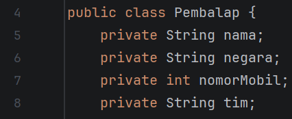
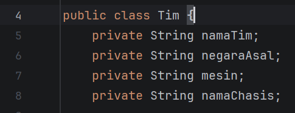
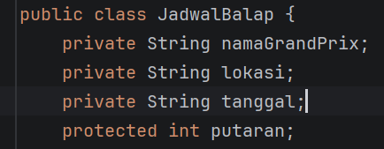
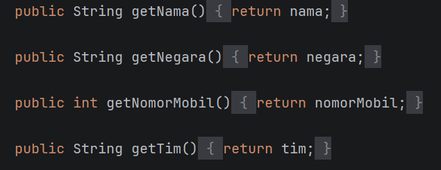
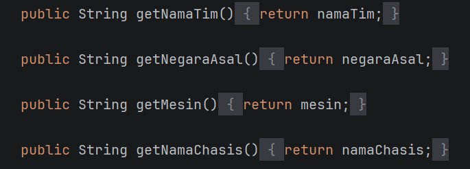
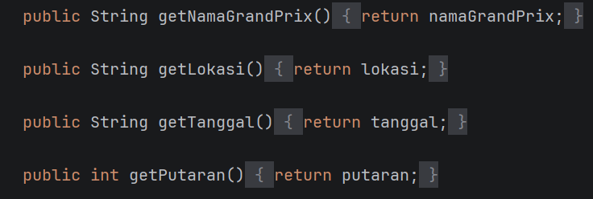
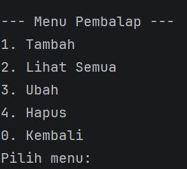

Nama  : Wahyu Aditya  
Nim   : 2409106067  
Kelas : B1'24  

1. Isi Program  
   Program yang dibuat ini berfungsi untuk melakukan crud (Untuk admin) dan read only untuk user
   sesuai dengan tema yang sudah dipilih. Tema yang dipilih praktikan adalah sistem
   informasi balapan formula 1. Untuk data yang bisa diubah sendiri ada 3, yaitu data pembalap, tim, dan jadwal balapan.
   Untuk data pembalap sendiri, yang bisa dicrud adalah nama, negara, nomor, dan tim. Untuk data tim yang bisa dicrud
   ada nama timnya, asal negara, mesin yang digunakan, dan nama chasisnya. Dan untul jadwalbalap yang bisa dicrud
   ada nama balapannya, lokasi, tanggal, dan putaran ke berapa balapan tersebut. Pada posttest ini, program juga menerapkan
   konsep enkapsulasi dengan menggunakan access modifier dan getter setter pada setiap class 
    

2. Penerapan Enkapsulasi  
   2.1 Access Modifier Private  
       Digunakan pada semua property di class pembalap, tim, dan jadwalbalap (kecuali properti putaran)  
         
    
         
    
         
    
    
   2.2 Access Modifier Public  
       Digunakan pada semua getter, setter, constructor, dan crud  
         
    
         
    
         
    
    
   2.3 Access Modifier Protected  
       Digunakan pada property putaran  
         
    
    
   2.4 Access Modifer Default  
       Digunakan pada method tampilkaninfo dan semua method yang ada di class errorhandling  
    
   2.5 Getter dan Setter  
       Untuk mengambil data property yang bersifat private, diperlukan method getter. Sementara untuk mengubah nilai
       property yang bersifat private, digunakan method setter, karena tidak bisa langsung diubah dari luar calss. Pada
       posttest ini, Getter dan setter digunakan pada seluruh property di class pembalap, tim, dan jadwal. Pada setter
       juga terdapat validasi data seperti tidak boleh kosong, dan kalau input angka tidak boleh bernilai kurang atau
       sama dengan 0 
    
3. Output Program  
   2.1 Output Awal  
     
    

   2.2 Login Admin  
     
    

   2.3 Menu Admin  
     
    

   2.4 Menu User  
     
    

   2.5 Menu Crud Pembalap  
     
    

   2.6 Menu Crud Tim  
     
    

   2.7 Menu Crud Jadwal  
     
    