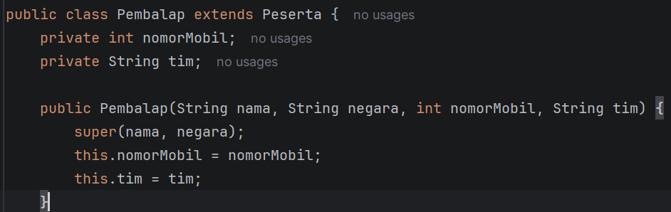
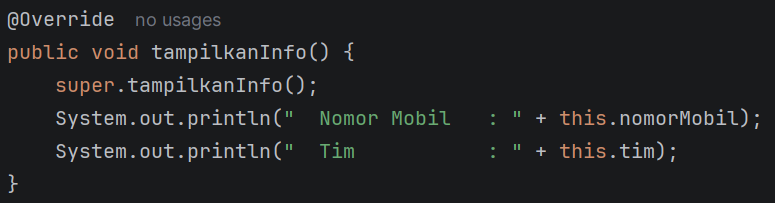
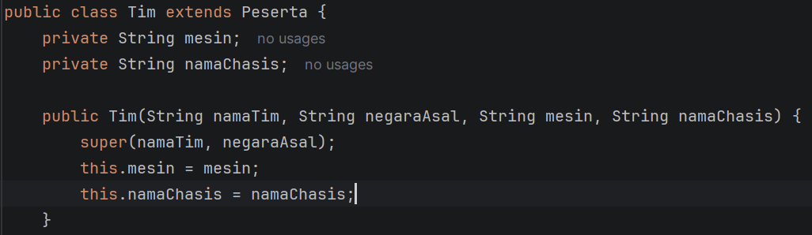
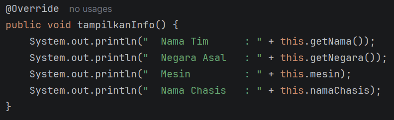
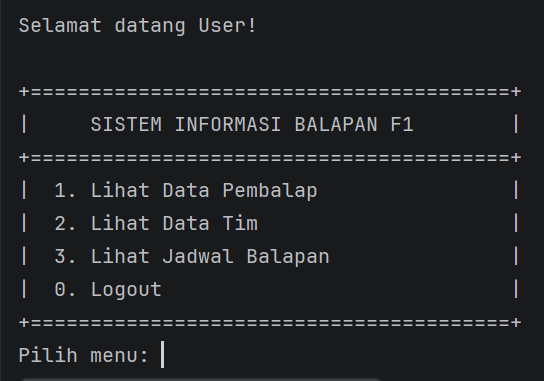

Nama  : Wahyu Aditya  
Nim   : 2409106067  
Kelas : B1'24  

1. Isi Program  
   Program yang dibuat ini merupakan lanjutan dari posttest sebelumnya yang menerapkan konsep inheritamce.  Program
   berfungsi untuk melakukan crud (Untuk admin) dan read only untuk user sesuai dengan tema yang sudah dipilih. Tema
   yang dipilih praktikan adalah sistem informasi balapan formula 1. Untuk data yang bisa diubah sendiri ada 3, yaitu
   data pembalap, tim, dan jadwal balapan. Untuk data pembalap sendiri, yang bisa dicrud adalah nama, negara, nomor,
   dan tim. Untuk data tim yang bisa dicrud ada nama timnya, asal negara, mesin yang digunakan, dan nama chasisnya. 
   Dan untuk jadwalbalap yang bisa dicrud ada nama balapannya, lokasi, tanggal, dan putaran ke berapa balapan tersebut.
   Pada posttest ini, program menerapkan konsep inheritance dengan menambahkan superclass Peserta yang diwarisi oleh
   subclass Pembalap dan Tim.  
    

   2. Penerapan Inheritance  
      2.1 Supercalss Peserta  
          Merupakan superclass yang menyimpan property dan method yang sama2 dimiliki oleh pembalap dan tim, yaitu nama dan
          negara beserta getter setter, dan method tampikanInfo  
       
       
      2.2 Subclass Pembalap  
          Merupakan subclass yang mmewarisi class Peserta menggunakan keyword extends. Constructor Pembalap memanggil
          constructor superclass menggunakan keyword super() untuk menginisialisasi nama dan negara. Method tampilkanInfo
          di-override untuk menampilkan data tambahan milik Pembalap yaitu nomor mobil dan tim  
            
       
            
       
       
      2.3 Subclass Tim  
          Merupakan subclass yang mewarisi class Peserta menggunakan keyword extends. Constructor Tim memanggil constructor
          superclass menggunakan keyword super() untuk menginisialisasi nama tim dan negara asal. Method tampilkanInfo
          di-override untuk menampilkan data tambahan milik Tim yaitu mesin dan nama chasis  
            
           
            
       
       
      2.4 Access Modifer Default  
          Digunakan pada method tampilkaninfo dan semua method yang ada di class errorhandling  
       
      2.5 Getter dan Setter  
          Untuk mengambil data property yang bersifat private, diperlukan method getter. Sementara untuk mengubah nilai
          property yang bersifat private, digunakan method setter, karena tidak bisa langsung diubah dari luar calss. Pada
          posttest ini, Getter dan setter digunakan pada seluruh property di class pembalap, tim, dan jadwal. Pada setter
          juga terdapat validasi data seperti tidak boleh kosong, dan kalau input angka tidak boleh bernilai kurang atau
          sama dengan 0 
       
3. Output Program  
   2.1 Output Awal  
     
    

   2.2 Login Admin  
     
    

   2.3 Menu Admin  
     
    

   2.4 Menu User  
     
    

   2.5 Menu Crud Pembalap  
     
    

   2.6 Menu Crud Tim  
     
    

   2.7 Menu Crud Jadwal  
     
    