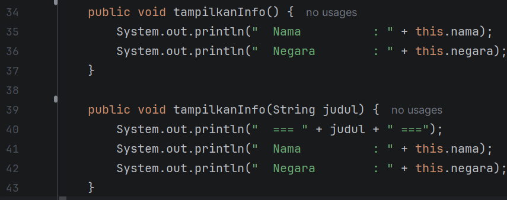
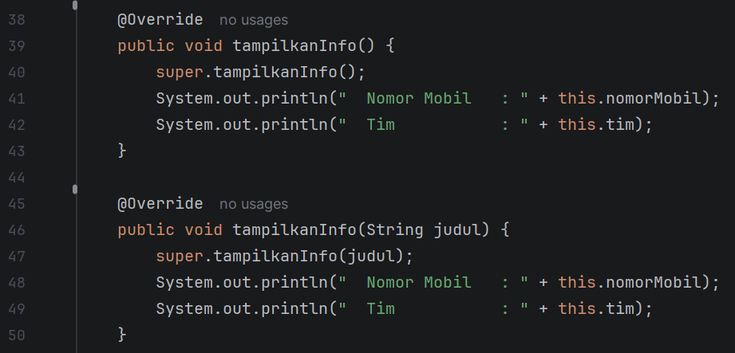
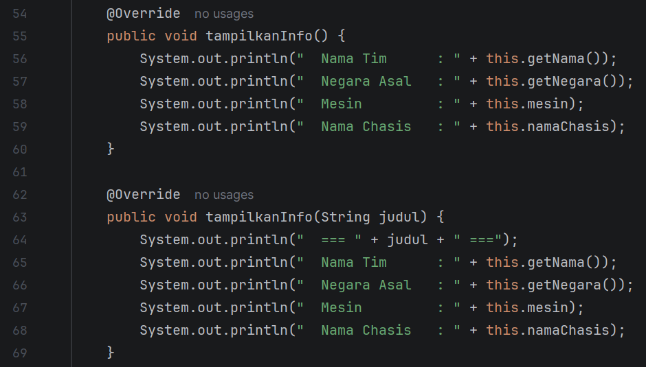

Nama  : Wahyu Aditya  
Nim   : 2409106067  
Kelas : B1'24  

1. Isi Program  
   Program yang dibuat ini merupakan lanjutan dari posttest sebelumnya yang menerapkan konsep polymorphism.  Program
   berfungsi untuk melakukan crud (Untuk admin) dan read only untuk user sesuai dengan tema yang sudah dipilih. Tema
   yang dipilih praktikan adalah sistem informasi balapan formula 1. Untuk data yang bisa diubah sendiri ada 3, yaitu
   data pembalap, tim, dan jadwal balapan. Untuk data pembalap sendiri, yang bisa dicrud adalah nama, negara, nomor,
   dan tim. Untuk data tim yang bisa dicrud ada nama timnya, asal negara, mesin yang digunakan, dan nama chasisnya. 
   Dan untuk jadwalbalap yang bisa dicrud ada nama balapannya, lokasi, tanggal, dan putaran ke berapa balapan tersebut.
   Pada posttest ini, program menerapkan konsep polymorphism dengan membuat method overloading dan method overriding pada
   class peserta, pembalap, dan tim.  
    

   2. Penerapan Polymorphism  
      2.1 Method Overloading  
          Overloading diterapkan pada class peserta dengan membuat 2 method tampilkanInfo() yang mana satu tidak memiliki
          parameter dan hanya menampilkan nama dan negara, sementara method satunya memiliki parameter string judul yang
          digunakan untuk menampilkan judul sebelum data ditampilkan  
            
       
       
      2.2 Method Overriding  
          Overriding diterapkan pada subclass pembalap dan tim. Kedua subclass mengoverride kedua method tampilkanInfo()
          milik peserta untuk menampilkan data tambahan yang dimiliki oleh masing-masing subclass. Pada pembalap, data
          tambahan yang ditampilkan adalah nomor mobil dan tim. Dan pada tim, data tambahan yang ditampilkan dalah mesin
          dan nama chasis.  
            
       
            
       
       
3. Output Program  
   2.1 Output Awal  
     
    

   2.2 Login Admin  
     
    

   2.3 Menu Admin  
     
    

   2.4 Menu User  
     
    

   2.5 Menu Crud Pembalap  
     
    

   2.6 Menu Crud Tim  
     
    

   2.7 Menu Crud Jadwal  
     
    