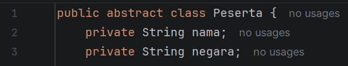
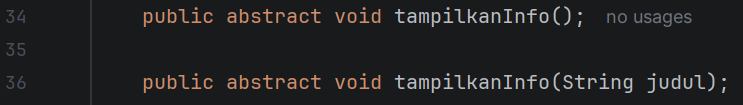
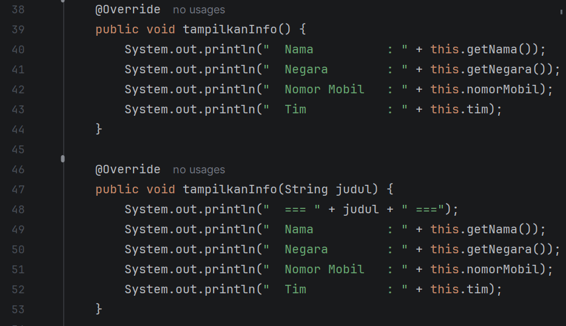
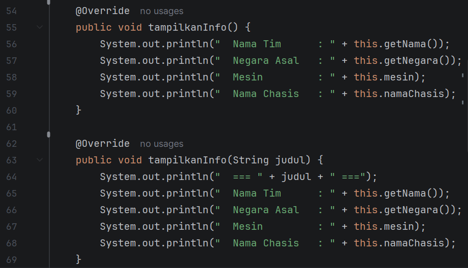
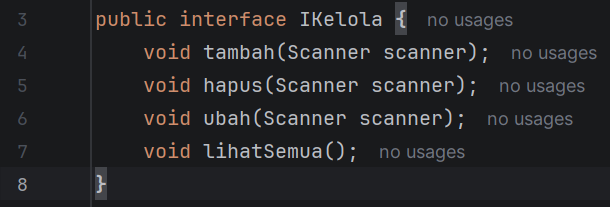
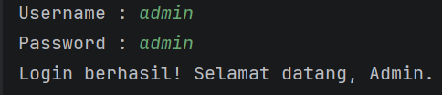
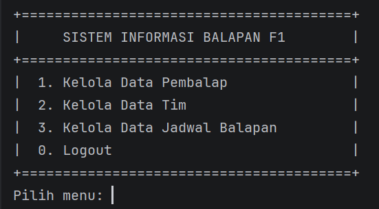
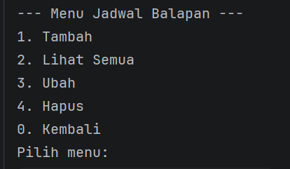

Nama  : Wahyu Aditya  
Nim   : 2409106067  
Kelas : B1'24  

1. Isi Program  
   Program yang dibuat ini merupakan lanjutan dari posttest sebelumnya yang menerapkan konsep abstraction.  Program
   berfungsi untuk melakukan crud (Untuk admin) dan read only untuk user sesuai dengan tema yang sudah dipilih. Tema
   yang dipilih praktikan adalah sistem informasi balapan formula 1. Untuk data yang bisa diubah sendiri ada 3, yaitu
   data pembalap, tim, dan jadwal balapan. Untuk data pembalap sendiri, yang bisa dicrud adalah nama, negara, nomor,
   dan tim. Untuk data tim yang bisa dicrud ada nama timnya, asal negara, mesin yang digunakan, dan nama chasisnya. 
   Dan untuk jadwalbalap yang bisa dicrud ada nama balapannya, lokasi, tanggal, dan putaran ke berapa balapan tersebut.
   Pada posttest ini, program menerapkan konsep abstraction dengan mengubah class peserta menjadi abstract class, menambahkan
   abstract method, dan membuat interface IKelola yang diimplementasikan pada class JadwalBalap.  
    

   2. Penerapan Abstraction  
      2.1 Abstract Class Peserta  
          Class peserta diubah menjadi abstract dengan menambahkan kata abstract sebelum class. Karena diubah menjadi abstract
          class, Peserta tidak dapat dibuat menjadi object secara langsung dan hanya bisa digunakan melalui subclass yang mewarisinya
          yaoti Pembalap dan Tim  
            
       
       
      2.2 Abstract Method  
          Pada class Peserta terdapat dua abstract method yaitu tampilkanInfo() dan tanpilkanInfo(String judul). Kedua
          class tersebut tidak memiliki body dan wajib diimplementasikan oleh setiap subclass yang mewarisi class peserta  
            
       
       
      2.3 Implementasi Abstract Method di SubClass Pembalap  
          Subclass Pembalap mengimplementasikan kedua abstract method dari Peserta. Method tampilkanInfo() menampilkan
          seluruh data pembalap yaitu nama, negara, nomor mobil, dan tim. Method tampilkanInfo dengan parameter judul
          menampilkan data yang sama dengan tambahan judul di atasnya.  
            
           
           
      2.4 Implementasi Abstract Method di SubClass Tim  
      Subclass Pembalap mengimplementasikan kedua abstract method dari Peserta. Method tampilkanInfo() menampilkan
      seluruh data tim yaitu nama tim, negara, mesin, dan nama chasis. Method tampilkanInfo dengan parameter judul
      menampilkan data yang sama dengan tambahan judul di atasnya.  
        
       
       
      2.5 Interface IKelola  
      Interface IKelola dibuat menggunakan keyword interface dan berisi 4 method yaitu tambah, lihatSemua, ubah, dan
      hapus. Keempat method tersebut tidak memiliki body karena interface hanya mendefinisikan kontrak yang harus dipenuhi
      oleh class yang mengimplementasikannya.  
        
       
       
      2.6 Implementasi Interface di JadwalBalap  
      Class JadwalBalap mengimplementasikan interface IKelola menggunakan keyword implements. Keempat method dari interface
      yaitu tambah, lihatSemua, ubah, dan hapus diimplementasikan seluruhnya di dalam class JadwalBalap menggunakan keyword
      Override.  
        
       
       

3. Output Program  
   2.1 Output Awal  
     
    

   2.2 Login Admin  
     
    

   2.3 Menu Admin  
     
    

   2.4 Menu User  
     
    

   2.5 Menu Crud Pembalap  
     
    

   2.6 Menu Crud Tim  
     
    

   2.7 Menu Crud Jadwal  
     
    